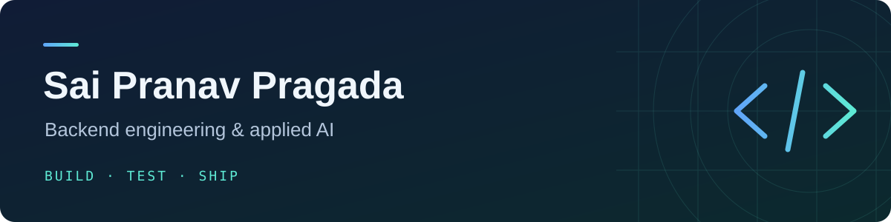

  

### Hey, I'm Pranav 👋

I build backend systems and AI applications that solve everyday problems — from tracking expenses to finding your next movie.

- 🎓 M.S. in Computer Science · Purdue University Northwest
- 🛠️ Working with Python, APIs, databases, and applied machine learning
- 🧪 Interested in reliable software: thoughtful design, automated tests, and useful documentation

### My toolkit

**Backend** &nbsp; `Python` `FastAPI` `Flask` `SQLAlchemy`  
**Data & AI** &nbsp; `PostgreSQL` `Redis` `TensorFlow` `scikit-learn` `FAISS`  
**Shipping** &nbsp; `Docker` `GitHub Actions` `pytest` `Git`

### Things I've built

💸 **[Expense Tracker](https://github.com/PranaPragada7/Expense_Tracker)**  
A personal finance API with private accounts, spending analytics, and a conversational AI assistant.

🎬 **[CineBot](https://github.com/PranaPragada7/CineBot-NLP-Project)**  
A movie recommender that combines semantic search with personalized recommendations and remembers your conversations.

📚 **[Study Tutor](https://github.com/PranaPragada7/Study-Tutor-Agent)**  
An adaptive study companion with spaced repetition, personalized practice, and offline tutoring.

🔐 **[CipherDesk](https://github.com/PranaPragada7/Php-Security-App)**  
A security-focused PHP portal with role-based access, encrypted records, and audit trails.

👁️ **[Glaucoma CDR Estimation](https://github.com/PranaPragada7/Glaucoma-Cdr-Estimation-Unet)**  
A computer vision research project for optic disc and cup segmentation using U-Net.
